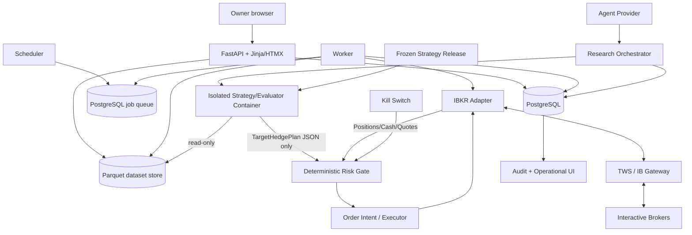

# TailHedge — Technical Architecture

## 1. Architecture goals

- Keep the research system reproducible and difficult for an agent to tamper with.
- Keep broker execution deterministic, auditable, and physically separated from AI/strategy generation.
- Support a single-user local/private deployment without Kubernetes, Redis, or distributed infrastructure.
- Make the first vertical slice runnable with synthetic data before paid market data or an IBKR account is available.
- Preserve an upgrade path from research-only to shadow/paper and later to tightly bounded live execution.

## 2. Technology choices

| Concern | Choice | Rationale |
|---|---|---|
| Language | Python 3.12+ | Best fit for options research, DuckDB/Parquet, IBKR libraries, numerical testing, and AI tooling. |
| Web/backend | FastAPI | Typed request/response models, simple async integration, OpenAPI, mature ecosystem. |
| UI | Jinja2 + HTMX + small vanilla JS | Single-user operations console does not justify a separate SPA/toolchain. Server-rendered HTML is easier to audit and test. |
| Operational DB | PostgreSQL 16+ | Reliable transactions, row locking, JSONB, migrations, concurrent web/worker access, strong audit persistence. |
| ORM/migrations | SQLAlchemy 2 + Alembic | Widely supported and explicit database evolution. |
| Research storage | Parquet + DuckDB | Efficient columnar local analytics without loading option history into Postgres. |
| Numerical/data | pandas or Polars behind repository interfaces; NumPy | Familiar ecosystem; keep domain logic independent of dataframe implementation where practical. |
| Typed configuration | Pydantic Settings | Validation and clear environment/config precedence. |
| Broker integration | IBKR TWS API through an adapter | Supports account/position data and orders; can connect to TWS/IB Gateway. Adapter prevents IBKR types leaking into domain logic. |
| Strategy isolation | Containerized evaluator (Docker/Podman-compatible OCI runtime) | Arbitrary agent-generated Python must not run inside the broker/web process. Use no network, read-only root FS, dropped capabilities, resource limits. |
| Background jobs | PostgreSQL-backed lightweight job table + dedicated worker process | Avoid Redis/Celery for a single-host application while preserving durable asynchronous jobs. |
| Scheduled daily run | Dedicated scheduler process that creates idempotent jobs; exchange-time aware | Keeps scheduling separate from web lifecycle. No trade occurs without runtime market/broker validation. |
| Tests | pytest + property-based tests (Hypothesis where useful) + Playwright for critical UI | Good Python coverage and browser-level verification. |
| Packaging | `uv` or standard `pyproject.toml`; Docker Compose for local/prod-like services | Reproducible environment with low ceremony. |

**Implementation decision:** use PostgreSQL from the start rather than SQLite because research workers, the web process, and broker/scheduler processes will concurrently update durable state. This is modest extra infrastructure and removes a class of locking/migration problems later.

## 3. High-level architecture



### Trust boundary

There are three explicit trust domains:

1. **Research/agent domain** — may propose strategy source and consume permitted experiment feedback.
2. **Evaluator domain** — immutable backtester/scorer and data partitions; runs proposed source in an isolated environment.
3. **Broker domain** — portfolio reconciliation, deterministic target-to-order translation, risk gate, and order executor. It never accepts direct “place this order” commands from the research agent.

## 4. Repository architecture

Recommended future layout:

```text
/
├── README.md
├── pyproject.toml
├── compose.yaml
├── .env.example
├── docs/
├── src/tailhedge/
│   ├── domain/
│   │   ├── portfolio.py
│   │   ├── instruments.py
│   │   ├── strategy.py
│   │   ├── risk.py
│   │   └── money.py
│   ├── data/
│   │   ├── canonical_schema.py
│   │   ├── importers/
│   │   ├── manifests.py
│   │   └── validation.py
│   ├── backtest/
│   │   ├── engine.py
│   │   ├── execution_model.py
│   │   ├── metrics.py
│   │   ├── splits.py
│   │   └── scenarios.py
│   ├── research/
│   │   ├── campaigns.py
│   │   ├── orchestrator.py
│   │   ├── agent_provider.py
│   │   ├── evaluator.py
│   │   ├── robustness.py
│   │   └── releases.py
│   ├── strategy_runtime/
│   │   ├── contract.py
│   │   └── sandbox.py
│   ├── broker/
│   │   ├── base.py
│   │   ├── ibkr.py
│   │   ├── fake.py
│   │   └── contract_selection.py
│   ├── operations/
│   │   ├── daily_run.py
│   │   ├── reconciliation.py
│   │   ├── risk_gate.py
│   │   ├── order_executor.py
│   │   └── kill_switch.py
│   ├── persistence/
│   │   ├── models.py
│   │   ├── repositories.py
│   │   └── migrations/
│   ├── jobs/
│   │   ├── worker.py
│   │   ├── scheduler.py
│   │   └── handlers.py
│   ├── web/
│   │   ├── app.py
│   │   ├── api/
│   │   ├── views/
│   │   ├── templates/
│   │   └── static/
│   ├── config.py
│   ├── logging.py
│   └── cli.py
├── strategy_sdk/
│   ├── README.md
│   └── tailhedge_strategy_sdk/
├── evaluator_image/
│   ├── Dockerfile
│   └── entrypoint.py
├── tests/
│   ├── unit/
│   ├── integration/
│   ├── e2e/
│   ├── fixtures/
│   └── golden/
└── data/                  # gitignored; user-owned licensed data
    ├── raw/
    ├── normalized/
    └── manifests/
```

## 5. Frontend architecture

The UI is server-rendered from FastAPI using Jinja templates. HTMX may be used for table filtering, job-status refreshes, forms, and modal content. Avoid a React/Vue build unless a future feature clearly requires it.

Frontend responsibilities:
- present operational and research state;
- submit typed commands to backend routes;
- never calculate authoritative risk, order size, budget, or performance metrics in the browser;
- display server-provided reason codes and provenance;
- require CSRF token on mutations;
- avoid exposing secrets or raw broker credentials.

Charts may use a small JS chart library, but every critical chart must have a numerical/table alternative.

## 6. Backend architecture

### 6.1 Domain layer
Pure Python types and services with no FastAPI, SQLAlchemy, IBKR, or dataframe dependencies. Key objects:
- `PortfolioSnapshot`
- `HedgeExposure`
- `OptionContract`
- `OptionQuote`
- `StrategyContext`
- `TargetHedgePlan`
- `RiskDecision`
- `OrderIntent`
- `ExecutionResult`

### 6.2 Application services
Coordinate domain operations and repositories:
- data import/validation service;
- backtest service;
- campaign/orchestration service;
- strategy release service;
- broker synchronization service;
- daily-run service;
- risk-gate service;
- execution/reconciliation service.

### 6.3 Adapter layer
- PostgreSQL repositories;
- DuckDB/Parquet reader;
- vendor data importers;
- IBKR adapter;
- fake broker;
- agent provider;
- notification provider;
- OCI sandbox runner.

## 7. Historical/research data architecture

### 7.1 Raw files
User-provided licensed files are immutable. On import:
- copy or reference raw files under a dataset-owned directory;
- calculate SHA-256 for every file;
- never overwrite an existing file under the same manifest identity.

For the ORATS Near End-of-day archive, the raw layer consists of the daily
S3-delivered ZIP files. Acquisition is resumable but intentionally one-time:
the object list is recorded before download, completed objects are not fetched
again unnecessarily, and credentials remain in the local secret mechanism.
Canonical processing streams one daily ZIP at a time and filters to SPX/SPXW
before expanding paired call/put rows. Every filtered partition links back to
the raw ZIP hashes.

The first external-source qualification is defined in
`docs/DATASET_QUALIFICATION.md`. The supplied ORATS sample remains local and
ignored; it is a format fixture and is not evidence of SPX coverage.

### 7.2 Canonical Parquet
Partition recommendation:

```text
data/normalized/<dataset_id>/options/
  underlying=SPX/root=SPX/year=2020/month=03/*.parquet
  underlying=SPX/root=SPXW/year=2020/month=03/*.parquet

data/normalized/<dataset_id>/underlying/
  year=2020/*.parquet
```

Canonical option snapshot fields are defined in `DATA_MODEL.md`. SPX contract
settlement semantics and expiry settlement artifacts are required before a
dataset can pass the real-data qualification gate.

### 7.3 DuckDB
DuckDB queries Parquet in place. Do not duplicate full chain history into PostgreSQL. Persist only manifests, dataset health, campaign metadata, experiment metrics, and selected trade/equity curves in Postgres or compact artifacts.

### 7.4 Data leakage prevention
The research split service materializes/mounts only the allowed partitions/ranges into an evaluator run. Final holdout paths are not provided to the research-agent runtime. Do not rely only on “please do not read this date range” instructions.

## 8. Strategy contract and sandbox

### 8.1 Strategy interface
The strategy SDK exposes a narrow versioned interface, conceptually:

```python
class Strategy:
    def decide(self, context: StrategyContext) -> TargetHedgePlan: ...
```

`StrategyContext` contains only time-appropriate, explicitly enabled features. It contains no future data and no broker/order methods.

`TargetHedgePlan` is declarative. Example fields:
- desired hedge budget allocation;
- desired tranches;
- per-tranche target delta/moneyness range;
- DTE range;
- target notional/coverage;
- allowed hold/roll/close behaviour;
- daily monetisation target;
- reinvestment fraction.

The strategy does **not** name broker order IDs or choose order types.

### 8.2 Agent-provider contract
Initial provider types:
- `ManualAgentProvider` — deterministic fixture/test provider.
- `LocalCommandAgentProvider` — runs a configured external command with a JSON request and expects a JSON response containing candidate source + rationale. This keeps the project vendor-neutral.

Future direct LLM APIs can implement the same interface.

The proposal agent/provider is a separate trust boundary from strategy evaluation. If it needs network/API credentials, run it with a **sanitised environment containing only its own provider credentials** and no broker/database secrets. A local-command provider should run under a separate OS user or container with only its request/response working directory, not the repository home directory or broker configuration.

### 8.3 Evaluator container restrictions
Required for agent-generated code:
- no network;
- read-only root filesystem;
- no host Docker socket;
- dropped Linux capabilities;
- unprivileged UID/GID;
- memory/CPU/time/process limits;
- read-only mount of evaluator package and allowed data slice;
- writable temporary directory only for result JSON;
- no broker/config/secrets mounts;
- evaluator verifies candidate source hash before run.

## 9. Backtester architecture

The backtester is event-driven on daily decision timestamps.

For each timestamp:
1. update underlying/core portfolio mark;
2. settle expired options if applicable;
3. mark existing hedge positions using configured conservative valuation rule;
4. build permitted `StrategyContext`;
5. obtain `TargetHedgePlan`;
6. select eligible historical contract(s) using only current snapshot;
7. apply simulated sell-to-close actions;
8. apply monetisation/reinvestment policy;
9. apply simulated buys subject to budget/cash/contract granularity;
10. persist ledger snapshot;
11. compute metrics after the run from the complete ledger.

All monetary calculations use explicit currency and decimal precision rules. Floating-point may be used for analytics, but broker cash/order calculations use `Decimal` or integer minor units where practical.

**Default historical fill assumption (implementation default, not a market claim):** buy at `mid + 25% of spread`, sell at `mid - 25% of spread`, after rejecting invalid/untradable quotes. Mandatory robustness cases include midpoint (diagnostic/optimistic), 50% of spread, and full ask/bid. The fill profile is frozen per campaign.

## 10. Research scoring architecture

Scoring profile is versioned and frozen per campaign. MVP default should use **gates + scalar rank**, not a single unconstrained CAGR objective.

Default gates:
- annualised/rolling premium spend within campaign cap;
- complete fold coverage;
- no accounting invariant failures;
- minimum tradable-quote rate;
- complexity within configured maximum;
- robustness suite not catastrophically worse than baseline thresholds.

Default scalar ranking profile (implementation assumption):

```text
fold_utility =
    (hedged_CAGR - unhedged_CAGR)
  + 0.25 * (abs(unhedged_max_drawdown) - abs(hedged_max_drawdown))

robust_score =
    median(fold_utility)
  - 0.50 * stdev(fold_utility)
  - complexity_penalty
```

All rates are decimals (e.g. 0.08 = 8%). Premium cost is already reflected in hedged CAGR and is also bounded by a hard cap, avoiding double counting in the base score.

`complexity_penalty` default:

```text
0.00025 * max(0, free_parameter_count - 4)
+ 0.00010 * conditional_branch_count
```

This exact profile is an **assumption** and must be implemented as versioned configuration, not hard-coded financial truth. Research reports always show underlying metrics so strategy selection is not reduced to the scalar.

Metric conventions (implemented in `tailhedge.backtest.metrics`, TASK-013):

- All rates are decimals (e.g. `0.08` = 8%).
- CAGR is geometric annualisation `(final/initial)^(1/years) − 1`; non-positive initial/final values or years raise (fail closed — a ruined backtest is never scored as "0% growth").
- Max drawdown is peak-to-trough on the equity curve, reported as a negative decimal; `max_drawdown_periods` counts observation periods between the peak and the trough of the max drawdown (equal to days only for daily curves).
- Premium spend is **gross**: the sum of absolute premium/commission event values; refunds never offset it.
- Drawdown reduction = `abs(baseline_dd) − abs(hedged_dd)` (positive is better).
- Tail efficiency = drawdown reduction ÷ total gross premium spend (fraction of drawdown per currency unit spent); defined for the hedged run against a baseline, `0` when no premium was spent.
- Fold utility = `ΔCAGR + 0.25 × drawdown reduction` (matches the default score above).

## 11. Multiple-testing and robustness evidence

The system records every experiment, enabling later calculation/reporting of research breadth. MVP should implement:
- complete trial count;
- best-vs-median candidate distribution;
- parameter-neighbour stability;
- blocked/rolling validation;
- leave-one-regime-out;
- final holdout.

Deflated Sharpe/PBO/SPA-style statistical tests may be added where assumptions fit the actual return series, but they must not replace the simpler provenance/holdout controls. See `OPEN_QUESTIONS.md` for exact statistical implementation scope.

## 12. Broker architecture

### 12.1 Broker adapter interface
Required methods:
- connectivity/authentication status;
- account summary;
- positions;
- open orders;
- recent executions/fills;
- contract lookup/details;
- option-chain discovery;
- market-data snapshot;
- place limit order;
- modify/cancel TailHedge order;
- reconcile broker order by client/order reference.

Implement `FakeBroker` first. Implement IBKR second.

### 12.2 TWS/IB Gateway
Use the TWS API via TWS or IB Gateway. The deployment must assume the gateway may restart/disconnect and that periodic user re-authentication is required. Broker connectivity is an external dependency, not an always-on invariant.

### 12.3 Historical data separation
Do **not** use IBKR as the historical options backtest source. Current IBKR documentation states expired-options market data is unavailable through normal historical interfaces. Historical research uses licensed independent data imported into TailHedge.

## 13. Daily operations architecture

Default schedule: 15:45 `America/New_York` on configured trading days.

Sequence:
1. create idempotent `DAILY_RUN` job;
2. verify kill switch/mode/release;
3. verify broker connection/environment/account;
4. fetch positions/cash/open orders/executions;
5. reconcile TailHedge state;
6. fetch current underlying/option contracts/quotes;
7. build strategy context;
8. execute strategy in isolated runtime;
9. validate target plan schema;
10. translate target plan to desired broker-neutral position deltas;
11. run deterministic risk gate;
12. in `SHADOW`, persist only;
13. in `PAPER`, re-quote and submit bounded limit orders;
14. monitor/reconcile until fill/cancel/timeout;
15. persist final state and notifications.

A scheduled run never assumes that regular hours are open merely because the clock equals 15:45 ET. It must verify current contract/trading state. Early-close days may be skipped in MVP rather than inventing a different decision timestamp.

## 14. Data persistence

PostgreSQL stores operational state and metadata. Parquet stores licensed/large research data. Strategy source and compact research artifacts may be stored on local object/filesystem storage keyed by content hash; metadata/ownership stays in Postgres.

Audit/event tables are append-only at application level.

## 15. Authentication and authorization

MVP is single-owner and private/local-first.

- Web app requires owner login for all non-health endpoints.
- Password hash uses Argon2id.
- State-changing browser requests require CSRF tokens.
- API may use the owner session cookie locally; optional personal API token can be added only if CLI-to-HTTP is required.
- No OAuth/OIDC is required for MVP.
- Broker authentication is separate and never reused as application authentication.

## 16. Job system

Tables: `jobs`, `job_attempts`.

Worker pattern:
- claim due job with `SELECT ... FOR UPDATE SKIP LOCKED`;
- mark leased with owner/lease expiry;
- heartbeat long tasks;
- persist progress after every research experiment;
- retry only idempotent/reconcilable operations;
- broker submission failures use reconciliation before retry.

No broker order is blindly retried from a generic job retry handler.

## 17. Caching

Minimal caching only:
- short-lived in-process cache for immutable config/reference mappings;
- current quote data is never served from a cache beyond its freshness threshold for trading decisions;
- research query caching may use DuckDB/materialized Parquet artifacts keyed by dataset/config hash.

Redis is not required.

## 18. Observability/logging

Use structured JSON logs with correlation IDs:
- request ID;
- job ID;
- campaign/experiment ID;
- daily-run ID;
- order-intent ID;
- broker order reference (masked as needed).

Metrics can initially be exposed as an internal `/metrics` endpoint or logged into Postgres. No external SaaS telemetry is required.

Critical invariants should emit both a log event and persistent audit/risk event.

## 19. Deployment approach

### Development
Docker Compose services:
- `postgres`;
- `web`;
- `worker`;
- `scheduler`;
- optionally `ibgateway` is **not** bundled unless licensing/operational constraints allow; developer can run TWS/IB Gateway separately;
- evaluator OCI image built locally.

### Initial production/private deployment
One user-controlled Linux machine/VM with:
- PostgreSQL;
- web service bound to localhost or private VPN only;
- worker + scheduler as system services;
- IB Gateway/TWS with supported GUI authentication path;
- encrypted disk and OS-level backup;
- no public internet exposure unless protected by a reverse proxy/VPN and explicit owner decision.

Do not deploy Kubernetes.

## 20. Environments

- `dev` — synthetic/fake broker; optional local data.
- `test` — deterministic fixtures only.
- `paper` — IBKR paper account; real quotes where available.
- `live` — post-MVP only; code/config gate must make this environment unavailable in MVP.

Database and broker account configuration must be environment-specific.

## 21. Configuration and secrets

Non-secret settings:
- DB URL host/name (without password where possible);
- dataset root;
- decision time/timezone;
- risk thresholds;
- mode enablement;
- broker host/port/client ID/account alias;
- agent provider command;
- sandbox resource limits.

Secrets:
- DB password;
- agent/API credentials if a provider needs them;
- notification credentials;
- any broker-related secret supported by the chosen connection approach.

Secrets come from environment/secret files mounted with restrictive permissions or OS secret management. They are never persisted in strategy contexts or experiment prompts.

## 22. Security considerations

- Treat agent-generated strategy code as untrusted code.
- Never mount broker sockets, credentials, Docker socket, or writable source tree into evaluator containers.
- Verify account/environment before every order submission.
- Require `SELL` intents to reference an existing long TailHedge-owned position; never infer sell-to-open.
- Risk gate is pure deterministic code with extensive tests.
- Use database transactions around intent state changes.
- Store broker client/order references to support reconciliation after crashes.
- Browser session cookies: `HttpOnly`, `SameSite=Strict`, `Secure` when TLS is used.
- Validate all uploaded files and enforce size/path rules.

## 23. Scalability considerations

Scale target is intentionally small: one portfolio, tens of thousands of research experiments, and years of option-chain history. Priorities are reproducibility and safety, not horizontal web throughput.

If experiment volume grows:
- workers can run in parallel because experiments are immutable;
- PostgreSQL queue claiming supports multiple workers;
- Parquet/DuckDB supports partition pruning;
- evaluator CPU limits prevent one strategy from exhausting the host.

Do not add distributed orchestration until profiling demonstrates a need.
